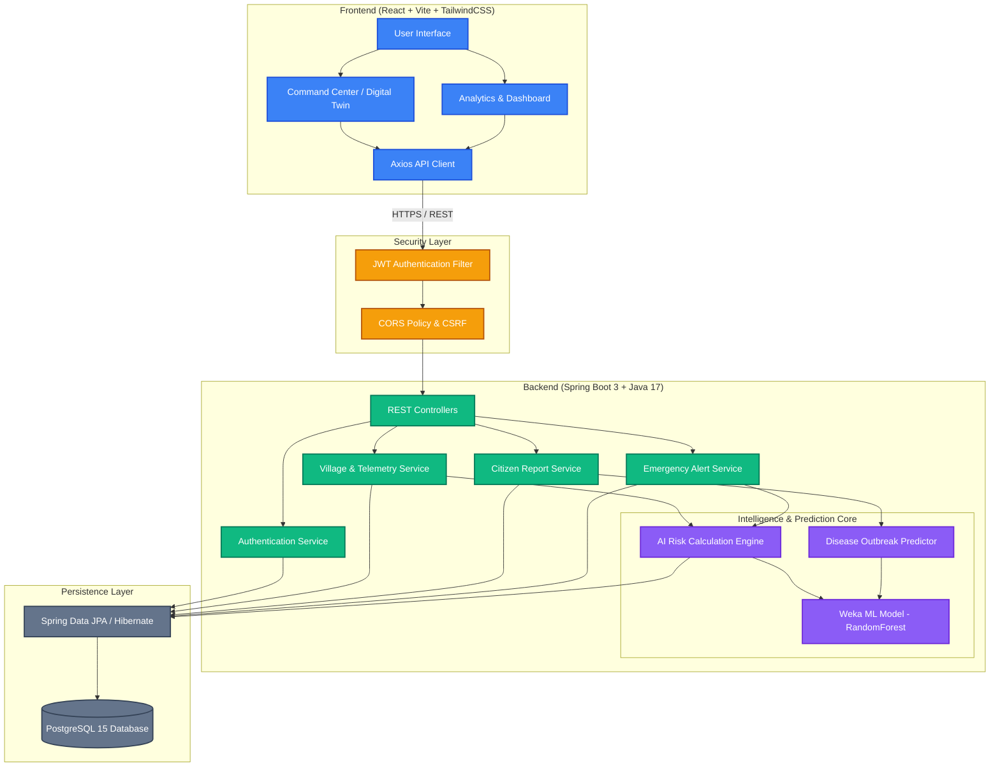

# AquaShield AI - System Architecture

```mermaid
graph TD
    %% Frontend Layer
    subgraph "Frontend (React + Vite + TailwindCSS)"
        UI[User Interface]
        CM[Command Center / Digital Twin]
        AM[Analytics & Dashboard]
        API_CLIENT[Axios API Client]
        
        UI --> CM
        UI --> AM
        CM --> API_CLIENT
        AM --> API_CLIENT
    end

    %% API Gateway / Security
    subgraph "Security Layer"
        JWT[JWT Authentication Filter]
        CORS[CORS Policy & CSRF]
        API_CLIENT -- "HTTPS / REST" --> JWT
        JWT --> CORS
    end

    %% Backend Services Layer
    subgraph "Backend (Spring Boot 3 + Java 17)"
        REST[REST Controllers]
        
        %% Services
        AuthSvc[Authentication Service]
        VillageSvc[Village & Telemetry Service]
        ReportSvc[Citizen Report Service]
        AlertSvc[Emergency Alert Service]
        
        %% Core Engines
        subgraph "Intelligence & Prediction Core"
            RiskEngine[AI Risk Calculation Engine]
            WekaML[Weka ML Model - RandomForest]
            PredictionSvc[Disease Outbreak Predictor]
            
            RiskEngine --> WekaML
            PredictionSvc --> WekaML
        end
        
        CORS --> REST
        REST --> AuthSvc
        REST --> VillageSvc
        REST --> ReportSvc
        REST --> AlertSvc
        
        VillageSvc --> RiskEngine
        ReportSvc --> PredictionSvc
        AlertSvc --> RiskEngine
    end

    %% Data Access Layer
    subgraph "Persistence Layer"
        JPA[Spring Data JPA / Hibernate]
        DB[(PostgreSQL 15 Database)]
        
        AuthSvc --> JPA
        VillageSvc --> JPA
        ReportSvc --> JPA
        AlertSvc --> JPA
        RiskEngine --> JPA
        
        JPA --> DB
    end

    %% Styling
    classDef frontend fill:#3B82F6,stroke:#1D4ED8,stroke-width:2px,color:#fff;
    classDef security fill:#F59E0B,stroke:#B45309,stroke-width:2px,color:#fff;
    classDef backend fill:#10B981,stroke:#047857,stroke-width:2px,color:#fff;
    classDef ai fill:#8B5CF6,stroke:#6D28D9,stroke-width:2px,color:#fff;
    classDef db fill:#64748B,stroke:#334155,stroke-width:2px,color:#fff;
    
    class UI,CM,AM,API_CLIENT frontend;
    class JWT,CORS security;
    class REST,AuthSvc,VillageSvc,ReportSvc,AlertSvc backend;
    class RiskEngine,WekaML,PredictionSvc ai;
    class JPA,DB db;
```
