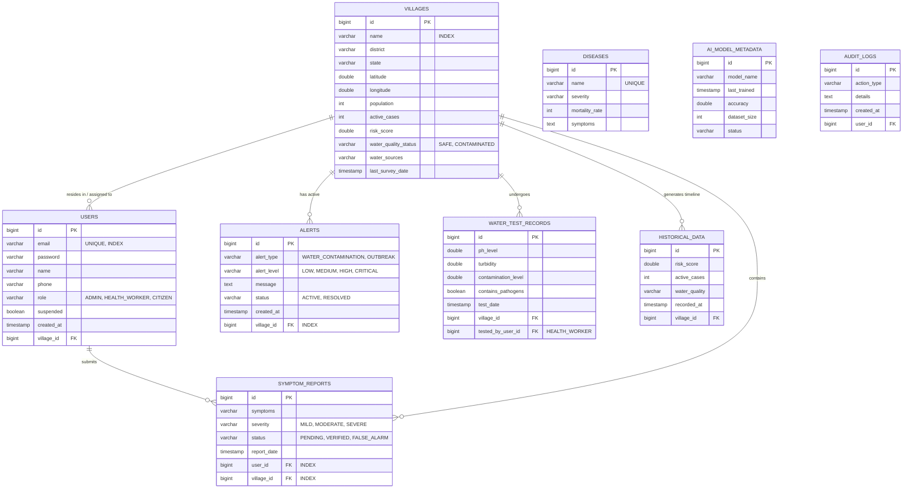

# AquaShield AI - Database Schema (ER Diagram)

```mermaid
erDiagram
    USERS ||--o{ SYMPTOM_REPORTS : "submits"
    VILLAGES ||--o{ USERS : "resides in / assigned to"
    VILLAGES ||--o{ SYMPTOM_REPORTS : "contains"
    VILLAGES ||--o{ ALERTS : "has active"
    VILLAGES ||--o{ WATER_TEST_RECORDS : "undergoes"
    VILLAGES ||--o{ HISTORICAL_DATA : "generates timeline"

    USERS {
        bigint id PK
        varchar email "UNIQUE, INDEX"
        varchar password
        varchar name
        varchar phone
        varchar role "ADMIN, HEALTH_WORKER, CITIZEN"
        boolean suspended
        timestamp created_at
        bigint village_id FK
    }

    VILLAGES {
        bigint id PK
        varchar name "INDEX"
        varchar district
        varchar state
        double latitude
        double longitude
        int population
        int active_cases
        double risk_score
        varchar water_quality_status "SAFE, CONTAMINATED"
        varchar water_sources
        timestamp last_survey_date
    }

    SYMPTOM_REPORTS {
        bigint id PK
        varchar symptoms
        varchar severity "MILD, MODERATE, SEVERE"
        varchar status "PENDING, VERIFIED, FALSE_ALARM"
        timestamp report_date
        bigint user_id FK "INDEX"
        bigint village_id FK "INDEX"
    }

    ALERTS {
        bigint id PK
        varchar alert_type "WATER_CONTAMINATION, OUTBREAK"
        varchar alert_level "LOW, MEDIUM, HIGH, CRITICAL"
        text message
        varchar status "ACTIVE, RESOLVED"
        timestamp created_at
        bigint village_id FK "INDEX"
    }

    WATER_TEST_RECORDS {
        bigint id PK
        double ph_level
        double turbidity
        double contamination_level
        boolean contains_pathogens
        timestamp test_date
        bigint village_id FK
        bigint tested_by_user_id FK "HEALTH_WORKER"
    }

    HISTORICAL_DATA {
        bigint id PK
        double risk_score
        int active_cases
        varchar water_quality
        timestamp recorded_at
        bigint village_id FK
    }
    
    DISEASES {
        bigint id PK
        varchar name "UNIQUE"
        varchar severity
        int mortality_rate
        text symptoms
    }

    AI_MODEL_METADATA {
        bigint id PK
        varchar model_name
        timestamp last_trained
        double accuracy
        int dataset_size
        varchar status
    }
    
    AUDIT_LOGS {
        bigint id PK
        varchar action_type
        text details
        timestamp created_at
        bigint user_id FK
    }
```
